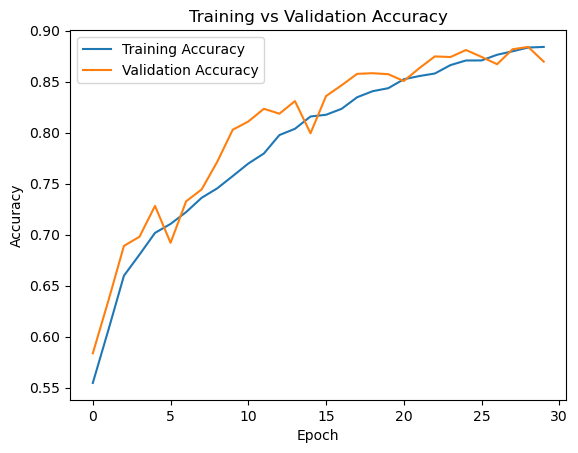
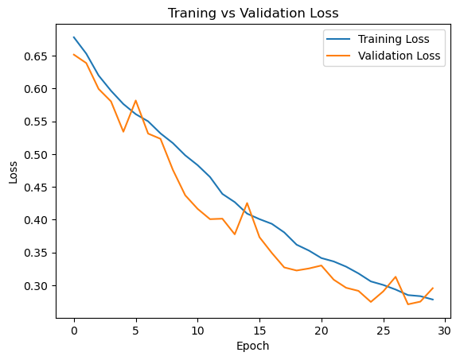
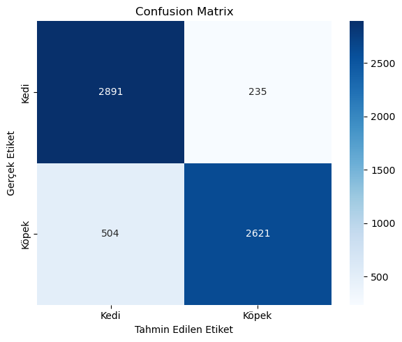

# Cats vs Dogs CNN Classfier

Bu proje, resimleri kedi veya köpek olarak sınıflandırmak için bir Evrişimli Sinir Ağı (CNN) uygular. Model TensorFlow/Keras kullanılarak oluşturulmuş olup, fotoğraflardaki kediler ile köpekleri yüksek doğrulukla ayırt edebilmektedir.

---

## Veri Seti

Proje, popüler Kediler ve Köpekler veri setini kullanmaktadır. Veri setini [Kaggle Dogs vs Cats veri seti](https://www.kaggle.com/c/dogs-vs-cats/data) adresinden indirebilirsiniz.

## Proje Yapısı

```
├── assets/
│   ├── confusion-matrix.png
│   ├── training-val-acc.png
│   └── training-val-loss.png
├── img_for_predictions/
│   └── (Test için örnek görseller)
├── models/
│   └── cat_vs_dog.h5
└── notebooks/
    └── main.ipynb
```

## Model Mimarisi

CNN mimarisi şunlardan oluşur:
- Artan filtre sayısına sahip 3 evrişim katmanı (32, 64, 128)
- Her evrişim katmanından sonra MaxPooling katmanı
- Global Average Pooling
- Sınıflandırma için dropout'lu yoğun katmanlar
- Sigmoid aktivasyonlu ikili çıktı

```python
model = Sequential([
    Conv2D(32, (3,3), padding='same', activation='relu', input_shape=(150,150,3)),
    MaxPooling2D(2,2),
    Conv2D(64, (3,3), padding='same', activation='relu'),
    MaxPooling2D(2,2),
    Conv2D(128, (3,3), padding='same', activation='relu'),
    MaxPooling2D(2,2),
    GlobalAveragePooling2D(),
    Dense(256, activation='relu'),
    Dropout(0.5),
    Dense(1, activation='sigmoid')
])
```

### Model Özeti

Aşağıda model.summary() fonksiyonunun çıktısı örnek olarak verilmiştir:

```
Model: "sequential"
_________________________________________________________________
 Layer (type)                  Output Shape              Param #   
=================================================================
 conv2d (Conv2D)               (None, 150, 150, 32)      896       
 max_pooling2d (MaxPooling2D)  (None, 75, 75, 32)        0         
 conv2d_1 (Conv2D)             (None, 75, 75, 64)        18496     
 max_pooling2d_1 (MaxPooling2) (None, 37, 37, 64)        0         
 conv2d_2 (Conv2D)             (None, 37, 37, 128)       73856     
 max_pooling2d_2 (MaxPooling2) (None, 18, 18, 128)       0         
 global_average_pooling2d (Gl) (None, 128)               0         
 dense (Dense)                 (None, 256)               33024     
 dropout (Dropout)             (None, 256)               0         
 dense_1 (Dense)               (None, 1)                 257       
=================================================================
Total params: 126,529
Trainable params: 126,529
Non-trainable params: 0
_________________________________________________________________
```
---
## Eğitim Sonuçları

### Eğitim ve Doğrulama Doğruluğu


### Eğitim ve Doğrulama Kayıp Değeri


### Model Performansı
Modelin performansı aşağıdaki karmaşıklık matrisi ile görselleştirilmiştir:



#### Örnek Doğruluk, Kayıp, F1, Recall ve Precision Skorları

Aşağıda modelin eğitim ve doğrulama sırasında elde ettiği bazı skorlar örnek olarak verilmiştir:

```
Epoch 1/30
 - accuracy: 0.5238 - loss: 0.6879 - val_accuracy: 0.5837 - val_loss: 0.6516
Epoch 2/30
 - accuracy: 0.6041 - loss: 0.6540 - val_accuracy: 0.6353 - val_loss: 0.6387
Epoch 3/30
 - accuracy: 0.6506 - loss: 0.6264 - val_accuracy: 0.6890 - val_loss: 0.5992
...
Epoch 30/30
 - accuracy: 0.8838 - loss: 0.2815 - val_accuracy: 0.8696 - val_loss: 0.2955

Sınıflandırma Raporu (örnek):

              precision    recall  f1-score   support

        Kedi       0.85      0.92      0.89      3126
       Köpek       0.92      0.84      0.88      3125

    accuracy                           0.88      6251
   macro avg       0.88      0.88      0.88      6251
weighted avg       0.88      0.88      0.88      6251
```

## Veri Artırma (Data Augmentation)

Aşırı öğrenmeyi önlemek ve modelin genelleme yeteneğini artırmak için aşağıdaki veri artırma teknikleri uygulanmıştır:
- Rastgele döndürme (30 dereceye kadar)
- Genişlik ve yükseklik kaydırmaları (%10)
- Shear dönüşümü
- Zoom varyasyonu
- Yatay çevirme

```python
train_gen = ImageDataGenerator(
    rescale=1/255,
    rotation_range=30,
    width_shift_range=0.1,
    height_shift_range=0.1,
    shear_range=0.2,
    zoom_range=0.2,
    horizontal_flip=True,
    fill_mode='reflect'
)
```

## Kullanım

1. Bu repoyu klonlayın
2. Kaggle'dan Kediler ve Köpekler veri setini indirin
3. Gerekli bağımlılıkları yükleyin:
   ```bash
   pip install tensorflow numpy matplotlib seaborn sklearn
   ```
4. `notebooks/main.ipynb` dosyasını açıp çalıştırın

## Tahmin Yapma

Model, yeni görseller üzerinde tahmin yapmak için kullanılabilir. Görsellerinizi `img_for_predictions` klasörüne yerleştirin ve notebook'ta verilen tahmin kodunu kullanın.

## Model Kontrol Noktaları

Eğitilmiş model, models dizininde `cat_vs_dog.h5` olarak kaydedilmiştir. Yeniden eğitmeye gerek kalmadan doğrudan tahmin yapmak için yükleyebilirsiniz.

```python
from tensorflow.keras.models import load_model
model = load_model('models/cat_vs_dog.h5')
```

## Gereksinimler
- TensorFlow
- Keras
- NumPy
- Matplotlib
- Seaborn
- Scikit-learn
