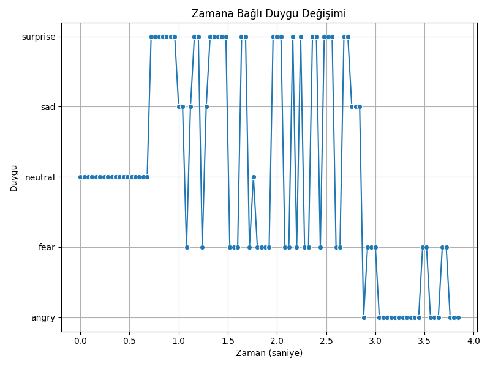
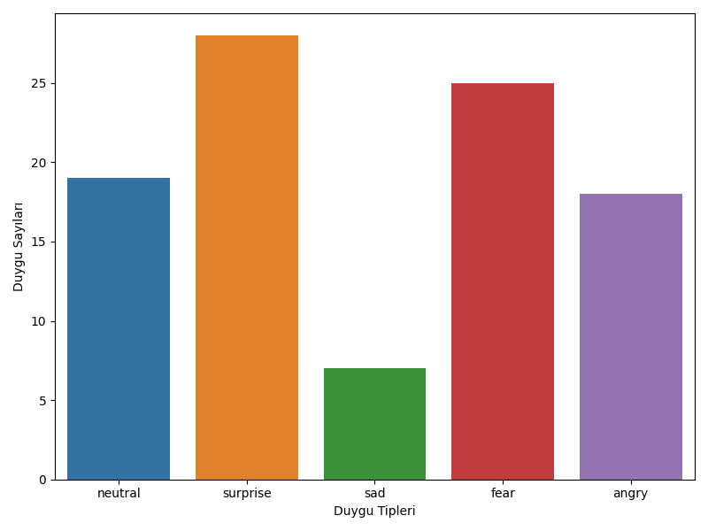

# FER ile Duygu Analizi
---

Bu projede, bir video dosyasındaki insan yüzleri ve bu yüzlerdeki duygular `FER` (Face Emotion Recognition) kütüphanesi kullanılarak gerçek zamanlı olarak tespit edilir. Proje, analiz sonuçlarını bir CSV dosyasına kaydeder ve bu verileri kullanarak duygu analizi raporları ve grafikleri oluşturur.

## Proje Yapısı

```
Emotion_Recognation_with_FER/
├── README.md                # Proje dokümantasyonu
├── main.py                  # Ana uygulama betiği
├── get_emotions.py          # Duygu tanıma mantığını içeren modül
├── graph.py                 # Grafik oluşturma mantığını içeren modül
├── analysis.csv             # Analiz sonuçlarının kaydedildiği dosya
├── assests/                 # Oluşturulan grafiklerin kaydedildiği klasör
│   ├── daily_report.png
│   └── per_second.png
└── videos/                  # Analiz edilecek videoların bulunduğu klasör
```

## Projenin Amacı

Bu projenin temel amacı, bir video kaydındaki kişilerin duygusal durumlarını zaman içinde analiz etmektir. Bu sayede:
- Belirli bir zaman aralığındaki en baskın duyguları belirlemek.
- Videonun genelindeki duygu dağılımını anlamak.
- Duygusal değişimlerin hangi anlarda meydana geldiğini tespit etmek.


## Kullanılan Model ve Teknoloji

- **FER (Face Emotion Recognition)**: Projenin kalbinde yer alan bu kütüphane, yüz tespiti için **MTCNN (Multi-task Cascaded Convolutional Networks)** ve duygu sınıflandırması için önceden eğitilmiş bir derin öğrenme modeli kullanır. Model, 7 temel duyguyu tanıyabilir: `kızgın`, `iğrenme`, `korku`, `mutlu`, `üzgün`, `şaşırmış` ve `nötr`.
- **OpenCV**: Videoları okumak, karelere (frame) ayırmak ve tespit edilen duyguları video üzerinde görselleştirmek için kullanılır.
- **Pandas**: Analiz sonuçlarını yapılandırılmış bir formatta tutmak ve `analysis.csv` dosyasına yazmak için kullanılır.
- **Matplotlib & Seaborn**: Analiz edilen verilerden anlamlı grafikler oluşturmak için kullanılır.

## Analiz Süreci

1.  **Video Yükleme**: `main.py` betiği, `videos` klasöründeki bir video dosyasını OpenCV ile yükler.
2.  **Duygu Tespiti**: Video saniye saniye işlenir. Her karede, `get_emotions.py` içindeki `FER` dedektörü yüzleri bulur ve her yüz için en baskın duyguyu ve skorunu belirler.
3.  **Veri Kaydı**: Tespit edilen her duygu; zaman damgası (saniye), duygu adı ve olasılık skoru ile birlikte `analysis.csv` dosyasına kaydedilir.
4.  **Görselleştirme**: Analiz tamamlandıktan sonra, `graph.py` betiği `analysis.csv` dosyasını okur ve iki tür grafik oluşturarak `assests` klasörüne kaydeder.

## Sonuçlar ve Analizler

Analiz sonucunda elde edilen veriler, videodaki duygusal akış hakkında önemli bilgiler sunar. Tüm görseller `assests/` klasöründe bulunur.

### 1. Zamana Bağlı Duygu Değişimi



Bu çizgi grafiği, videonun başından sonuna kadar duyguların zaman içinde nasıl değiştiğini gösterir. Grafiğin x ekseni zamanı (saniye), y ekseni ise tespit edilen duyguları temsil eder. Bu grafik, özellikle hangi anlarda duygusal geçişlerin yaşandığını anlamak için kullanışlıdır.

### 2. Genel Duygu Raporu



Videonun tamamında hangi duyguların ne kadar süreyle tespit edildiğini gösteren bir sütun grafiğidir. Bu rapor, videonun genel atmosferini veya en baskın duygusal tonunu hızlıca anlamayı sağlar. Örneğin, bir sunum videosunda en baskın duygunun "nötr" veya "mutlu" olması beklenebilir.


