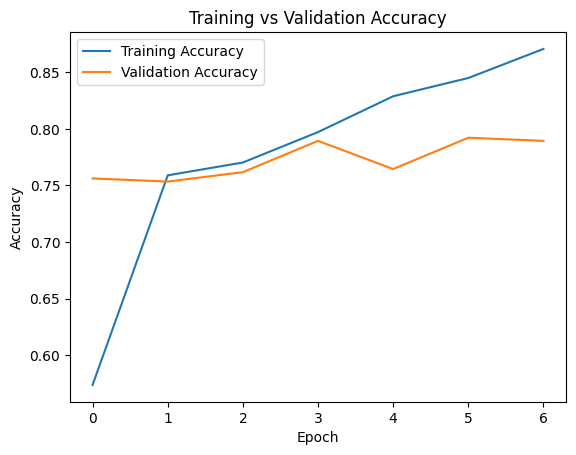
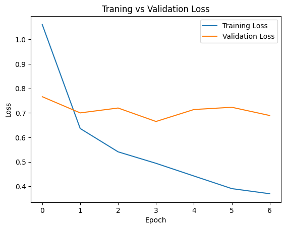
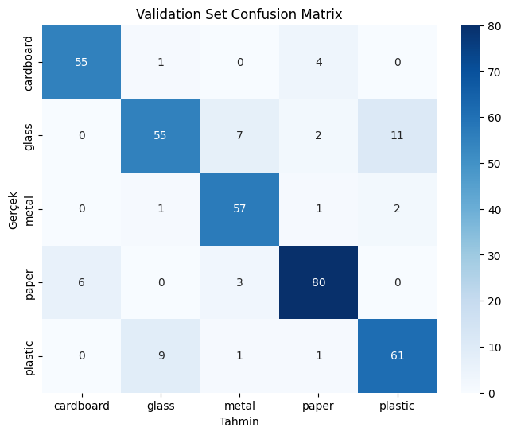

# Garbage Classification CNN Classifier

Bu proje, katı atık (çöp) görüntülerini malzeme türlerine göre sınıflandırmak için **transfer öğrenmesi (transfer learning)** yaklaşımını kullanan bir Evrişimli Sinir Ağı (CNN) modeli uygular. Model, TensorFlow/Keras kullanılarak eğitilmiş olup geri dönüşüm süreçlerinde **karton, cam, metal, kağıt ve plastik** atıkları otomatik olarak ayırt edebilmektedir.

---
## Veri Seti

Proje, [Garbage Classification ‑ TrashNet](https://github.com/garythung/trashnet) veri setini temel almaktadır. Veri setini doğrudan repodaki `dataset/garbage_dataset.zip` dosyasından ya da orijinal kaynaktan edinebilirsiniz.

## Proje Yapısı

```text
├── assests/
│   ├── accuracy_graph.png
│   ├── loss_graph.png
│   └── confision_matrix.png
├── dataset/
│   └── garbage_dataset.zip
├── model/
│   └── model.h5
├── notebook/
│   └── garbage_classification.ipynb
├── predict_images/
│   └── (Tahmin için örnek görseller)
├── predict.py
└── README.md
```

## Model Mimarisi

Model, **MobileNetV2** tabanlı transfer öğrenme yaklaşımı kullanır ve son katmanları atık türü sınıflandırması için özelleştirilmiştir:

```python
base_model = tf.keras.applications.MobileNetV2(
    input_shape=(224, 224, 3),
    include_top=False,
    weights="imagenet"
)
base_model.trainable = False  # Başlangıçta yalnızca öznitelik çıkarıcı olarak kullan

model = tf.keras.Sequential([
    base_model,
    tf.keras.layers.GlobalAveragePooling2D(),
    tf.keras.layers.Dense(128, activation="relu"),
    tf.keras.layers.Dropout(0.3),
    tf.keras.layers.Dense(5, activation="softmax")  # 5 sınıf
])
```

### Model Özeti (Örnek)

```
Model: "sequential"
_________________________________________________________________
 Layer (type)                 Output Shape              Param #   
=================================================================
 mobilenetv2_1.00_224 (Funct)  (None, 7, 7, 1280)       2257984   
 global_average_pooling2d (Gl) (None, 1280)             0         
 dense (Dense)                (None, 128)               163,968   
 dropout (Dropout)            (None, 128)               0         
 dense_1 (Dense)              (None, 5)                 645       
=================================================================
Total params: 2,422,597
Trainable params: 164,613
Non-trainable params: 2,257,984
_________________________________________________________________
```

---
## Eğitim Sonuçları

### Eğitim & Doğrulama Doğruluğu


### Eğitim & Doğrulama Kayıp Değeri


### Karmaşıklık Matrisi


#### Örnek Eğitim Çıktıları

```
Epoch 1/30
 - accuracy: 0.4466 - loss: 1.3914 - val_accuracy: 0.7562 - val_loss: 0.7663
Epoch 4/30
 - accuracy: 0.8212 - loss: 0.4751 - val_accuracy: 0.7895 - val_loss: 0.6650
Epoch 7/30
 - accuracy: 0.8636 - loss: 0.3833 - val_accuracy: 0.7895 - val_loss: 0.6894
```

## Veri Artırma (Data Augmentation)

Modelin genelleme kabiliyetini artırmak için aşağıdaki veri artırma teknikleri kullanılmıştır:

```python
train_gen = ImageDataGenerator(
    rescale=1/255,
    rotation_range=40,
    width_shift_range=0.2,
    height_shift_range=0.2,
    shear_range=0.2,
    zoom_range=0.2,
    horizontal_flip=True,
    fill_mode='nearest'
)
```

## Kullanım

1. Bu repoyu klonlayın
2. Gerekli kütüphaneleri yükleyin:

```bash
pip install tensorflow numpy matplotlib seaborn scikit-learn opencv-python
```

3. `notebook/garbage_classification.ipynb` dosyasını açarak modeli eğitin **veya** hazır modeli kullanmak için `model/model.h5` dosyasını indirin/koruyun.
4. Tahmin yapmak için görsellerinizi `predict_images/` klasörüne koyun ve ardından:

```bash
python predict.py
```

## Tahmin Senaryosu

`predict.py` betiği, belirtilen görsel üzerinde tahmin yapar ve sonuç etiketini güven skoru ile birlikte görsele yazar. Çıktı `prediction_output.jpg` olarak kaydedilir.

## Model Kontrol Noktası

Eğitim tamamlandığında en iyi ağırlıklar `model/model.h5` dosyasına kaydedilir. Bu ağırlıkları yeniden eğitime gerek kalmadan doğrudan yükleyebilirsiniz:

```python
from tensorflow.keras.models import load_model
model = load_model('model/model.h5')
```
