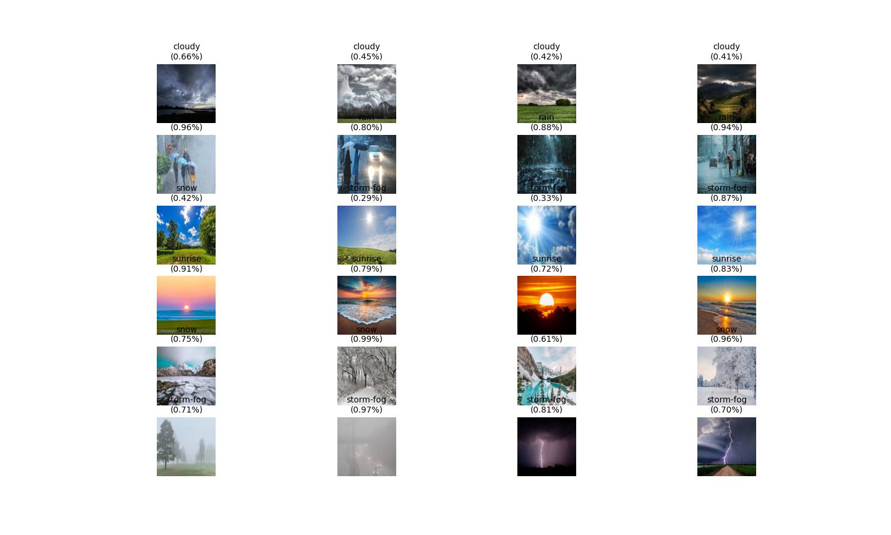
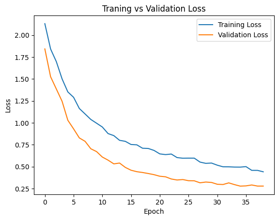

# VGG16 Based Weather Classification 

Bu proje VGG16 mimarisini baz alarak transfer learning metoduyla sınıflandırma yapan CNN modelidir. Model Tensorflow/Keras kullanıralarak eğitilmiş olup hava durumu veriseti ile birlikte hava durumunu ayırt edebilmektedir. 

---



--- 

## Veri Seti 

Verisetini doğrudan `dataset/dataset.zip` dosya yolundan indirip çıkarabilirsiniz. Veriseti train-test-validation olarak ayrılmış durumdadır. 

## Proje Yapısı 
```text
├── assests/
│   ├── acc-graph.png
│   ├── loss-graph.png
│   └── confision-matrix.png
├── dataset/
│   └── dataset.zip
├── model/
│   └── best_model.keras
├── notebook/
│   └── weather_classification.ipynb
├── predict_images/
│   └── (Tahmin için örnek görseller, her görsel kendi klasöründe bulunmaktadır.)
├── predict.py
└── README.md
└── results.jpg

```

## Model Mimarisi 

Model, **VGG16** tabanlı transfer öğrenme yaklaşımını kullanır ve son katmanları fine-tune edilerek hava durumu sınıflandırması için özelleştirilmiştir. 

```python
inputs = Input(shape=(224, 224, 3))
x = data_augmentation(inputs)

base_model = VGG16(
    weights='imagenet',
    include_top=False,
    input_tensor=x
)

fine_tune_at = 15

for layer in base_model.layers[:fine_tune_at]:
  layer.trainable = False

x = base_model.output
x = GlobalAveragePooling2D()(x)

x = Dense(256)(x)
x = BatchNormalization()(x)
x = Activation('relu')(x)
x = Dropout(0.3)(x)

x = Dense(128)(x)
x = BatchNormalization()(x)
x = Activation('relu')(x)
x = Dropout(0.3)(x)

x = Dense(64)(x)
x = BatchNormalization()(x)
x = Activation('relu')(x)
x = Dropout(0.3)(x)

outputs = Dense(6)(x)
outputs = Activation('softmax')(outputs)

model = Model(inputs=inputs, outputs=outputs)
```

### Model Özeti 
```
┏━━━━━━━━━━━━━━━━━━━━━━━━━━━━━━━━━┳━━━━━━━━━━━━━━━━━━━━━━━━┳━━━━━━━━━━━━━━━┓
┃ Layer (type)                    ┃ Output Shape           ┃       Param # ┃
┡━━━━━━━━━━━━━━━━━━━━━━━━━━━━━━━━━╇━━━━━━━━━━━━━━━━━━━━━━━━╇━━━━━━━━━━━━━━━┩
│ input_layer_4 (InputLayer)      │ (None, 224, 224, 3)    │             0 │
├─────────────────────────────────┼────────────────────────┼───────────────┤
│ sequential_2 (Sequential)       │ (None, 224, 224, 3)    │             0 │
├─────────────────────────────────┼────────────────────────┼───────────────┤
│ block1_conv1 (Conv2D)           │ (None, 224, 224, 64)   │         1,792 │
├─────────────────────────────────┼────────────────────────┼───────────────┤
│ block1_conv2 (Conv2D)           │ (None, 224, 224, 64)   │        36,928 │
├─────────────────────────────────┼────────────────────────┼───────────────┤
│ block1_pool (MaxPooling2D)      │ (None, 112, 112, 64)   │             0 │
├─────────────────────────────────┼────────────────────────┼───────────────┤
│ block2_conv1 (Conv2D)           │ (None, 112, 112, 128)  │        73,856 │
├─────────────────────────────────┼────────────────────────┼───────────────┤
│ block2_conv2 (Conv2D)           │ (None, 112, 112, 128)  │       147,584 │
├─────────────────────────────────┼────────────────────────┼───────────────┤
│ block2_pool (MaxPooling2D)      │ (None, 56, 56, 128)    │             0 │
├─────────────────────────────────┼────────────────────────┼───────────────┤
│ block3_conv1 (Conv2D)           │ (None, 56, 56, 256)    │       295,168 │
├─────────────────────────────────┼────────────────────────┼───────────────┤
│ block3_conv2 (Conv2D)           │ (None, 56, 56, 256)    │       590,080 │
├─────────────────────────────────┼────────────────────────┼───────────────┤
│ block3_conv3 (Conv2D)           │ (None, 56, 56, 256)    │       590,080 │
├─────────────────────────────────┼────────────────────────┼───────────────┤
│ block3_pool (MaxPooling2D)      │ (None, 28, 28, 256)    │             0 │
├─────────────────────────────────┼────────────────────────┼───────────────┤
│ block4_conv1 (Conv2D)           │ (None, 28, 28, 512)    │     1,180,160 │
├─────────────────────────────────┼────────────────────────┼───────────────┤
│ block4_conv2 (Conv2D)           │ (None, 28, 28, 512)    │     2,359,808 │
├─────────────────────────────────┼────────────────────────┼───────────────┤
│ block4_conv3 (Conv2D)           │ (None, 28, 28, 512)    │     2,359,808 │
├─────────────────────────────────┼────────────────────────┼───────────────┤
│ block4_pool (MaxPooling2D)      │ (None, 14, 14, 512)    │             0 │
├─────────────────────────────────┼────────────────────────┼───────────────┤
│ block5_conv1 (Conv2D)           │ (None, 14, 14, 512)    │     2,359,808 │
├─────────────────────────────────┼────────────────────────┼───────────────┤
│ block5_conv2 (Conv2D)           │ (None, 14, 14, 512)    │     2,359,808 │
├─────────────────────────────────┼────────────────────────┼───────────────┤
│ block5_conv3 (Conv2D)           │ (None, 14, 14, 512)    │     2,359,808 │
├─────────────────────────────────┼────────────────────────┼───────────────┤
│ block5_pool (MaxPooling2D)      │ (None, 7, 7, 512)      │             0 │
├─────────────────────────────────┼────────────────────────┼───────────────┤
│ global_average_pooling2d_1      │ (None, 512)            │             0 │
│ (GlobalAveragePooling2D)        │                        │               │
├─────────────────────────────────┼────────────────────────┼───────────────┤
│ dense_4 (Dense)                 │ (None, 256)            │       131,328 │
├─────────────────────────────────┼────────────────────────┼───────────────┤
│ dropout_3 (Dropout)             │ (None, 256)            │             0 │
├─────────────────────────────────┼────────────────────────┼───────────────┤
│ dense_5 (Dense)                 │ (None, 128)            │        32,896 │
├─────────────────────────────────┼────────────────────────┼───────────────┤
│ dropout_4 (Dropout)             │ (None, 128)            │             0 │
├─────────────────────────────────┼────────────────────────┼───────────────┤
│ dense_6 (Dense)                 │ (None, 64)             │         8,256 │
├─────────────────────────────────┼────────────────────────┼───────────────┤
│ dropout_5 (Dropout)             │ (None, 64)             │             0 │
├─────────────────────────────────┼────────────────────────┼───────────────┤
│ dense_7 (Dense)                 │ (None, 6)              │           390 │
└─────────────────────────────────┴────────────────────────┴───────────────┘
============================================================================
 Total params: 14,887,558 (56.79 MB)
 Trainable params: 7,252,294 (27.67 MB)
 Non-trainable params: 7,635,264 (29.13 MB)
 ───────────────────────────────────────────────────────────────────────────
 ```
---
## Eğitim Sonuçları 

### Train & Validation Accuracy 


### Train & Validation Loss 



### Confusion Matrix 


#### Örnek Eğitim Çıktıları 

```
Epoch 5/50
43/43 ━━━━━━━━━━━━━━━━━━━━ 0s 159ms/step - accuracy: 0.4549 - loss: 1.3796
Epoch 5: val_loss improved from 1.24472 to 1.02865, saving model to /content/drive/MyDrive/weather_classification/best_model.keras
43/43 ━━━━━━━━━━━━━━━━━━━━ 10s 226ms/step - accuracy: 0.4552 - loss: 1.3789 - val_accuracy: 0.6399 - val_loss: 1.0286
Epoch 6/50
43/43 ━━━━━━━━━━━━━━━━━━━━ 0s 162ms/step - accuracy: 0.4960 - loss: 1.3274
Epoch 6: val_loss improved from 1.02865 to 0.93046, saving model to /content/drive/MyDrive/weather_classification/best_model.keras
43/43 ━━━━━━━━━━━━━━━━━━━━ 9s 206ms/step - accuracy: 0.4963 - loss: 1.3266 - val_accuracy: 0.7098 - val_loss: 0.9305
Epoch 7/50
...
Epoch 39/50
43/43 ━━━━━━━━━━━━━━━━━━━━ 0s 166ms/step - accuracy: 0.8950 - loss: 0.4088
Epoch 39: val_loss did not improve from 0.27755
43/43 ━━━━━━━━━━━━━━━━━━━━ 8s 196ms/step - accuracy: 0.8950 - loss: 0.4095 - val_accuracy: 0.9196 - val_loss: 0.2781
```

## Veri Artırma (Data Augmentation)

Modelin verisetindeki yetersiz veri durumu gereği ve genelleme kabiliyetini artırmak için veri artırma kullanılmıştır. 

```python
data_augmentation = Sequential([
    layers.RandomFlip("horizontal", input_shape=(224, 224, 3)),
    layers.RandomRotation(0.3),
    layers.RandomZoom(0.2),
    layers.RandomContrast(0.2),
    layers.RandomBrightness(0.2),
    layers.RandomTranslation(0.2, 0.2)
])
```

## En İyi Modeli Kaydetme & Earyl Stopping

Modelin eğitim sırasında validation-loss değerini baz alarak en düşük değeri kaydeder. Bu da modelin en iyi parametreli halini daha iyisi gelene kadar değiştirmez. 

Early Stopping kullanarak da eğitim esnasında değerlerde değişim olmuyorsa ya da negatif yönde bir değişim oluyorsa model eğtimi sonlandırılarak gereksiz eğitim yüküne gidilmez. 

```python
from tensorflow.keras.callbacks import EarlyStopping
from tensorflow.keras.callbacks import ModelCheckpoint

checkpoint = ModelCheckpoint(
    filepath="/content/drive/MyDrive/weather_classification/best_model.keras",
    monitor='val_loss',
    save_best_only=True,
    mode='min',
    verbose=1
)

early_stop = EarlyStopping(
    monitor = 'val_loss',
    patience = 4,
    restore_best_weights=True,
    min_delta=0.001,
)
```

## Kullanım

1. Bu repoyu klonlayın
2. Gerekli kütüphaneleri yükleyin:

```bash
pip install tensorflow numpy matplotlib 
```

3. `notebook/weather_classification.ipynb` dosyasını açarak modeli eğitin **veya** hazır modeli kullanmak için `model/best_model.keras` dosyasını indirin/koruyun.
4. Tahmin yapmak için görsellerinizi `predict_images/` klasörüne koyun veya `predict_images/` klasöründeki hazır dosyaları kullanabilirsiniz ardından:

```bash
cd Weather_Classification
python predict.py
```

## Tahmin Senaryosu

`predict.py` betiği, belirtilen görsel üzerinde tahmin yapar ve sonuç etiketini güven skoru ile birlikte görsele yazar. Çıktı `results.jpg` olarak kaydedilir.

## Model Kontrol Noktası

Eğitim tamamlandığında en iyi ağırlıklar `model/best_model.keras` dosyasına kaydedilir. Bu ağırlıkları yeniden eğitime gerek kalmadan doğrudan yükleyebilirsiniz:

```python
from tensorflow.keras.models import load_model
model = load_model('model/best_model.keras')
```

