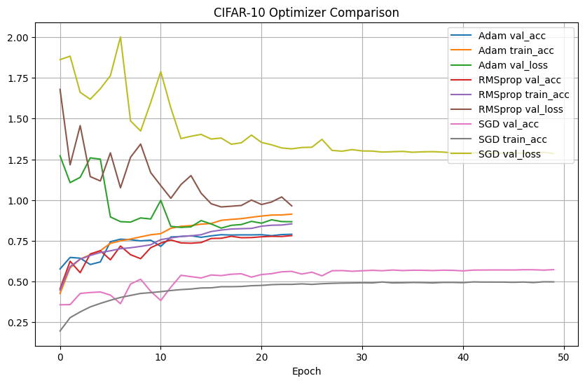
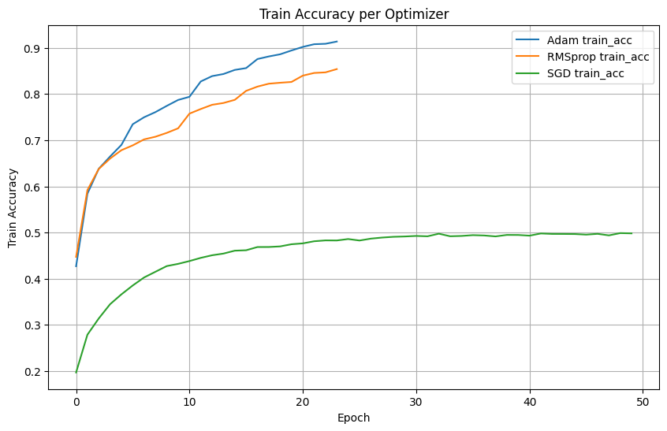
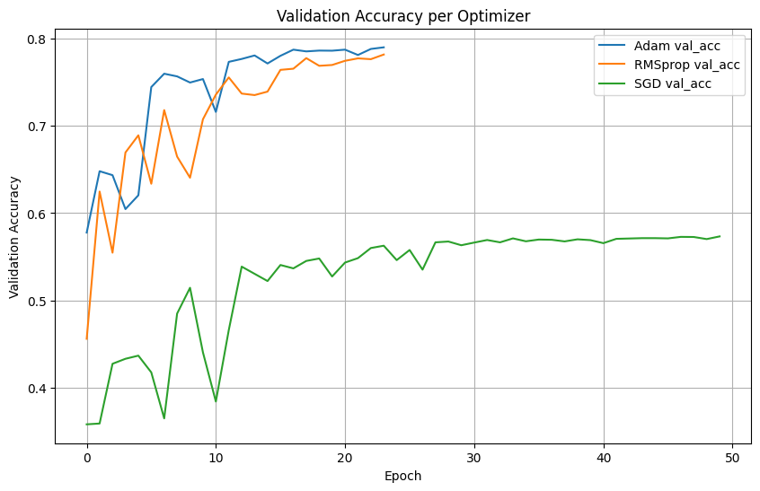
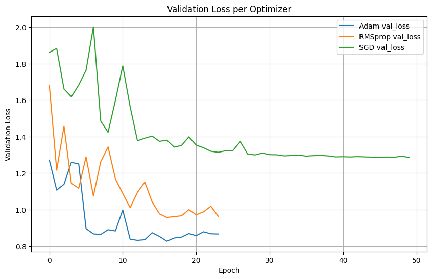
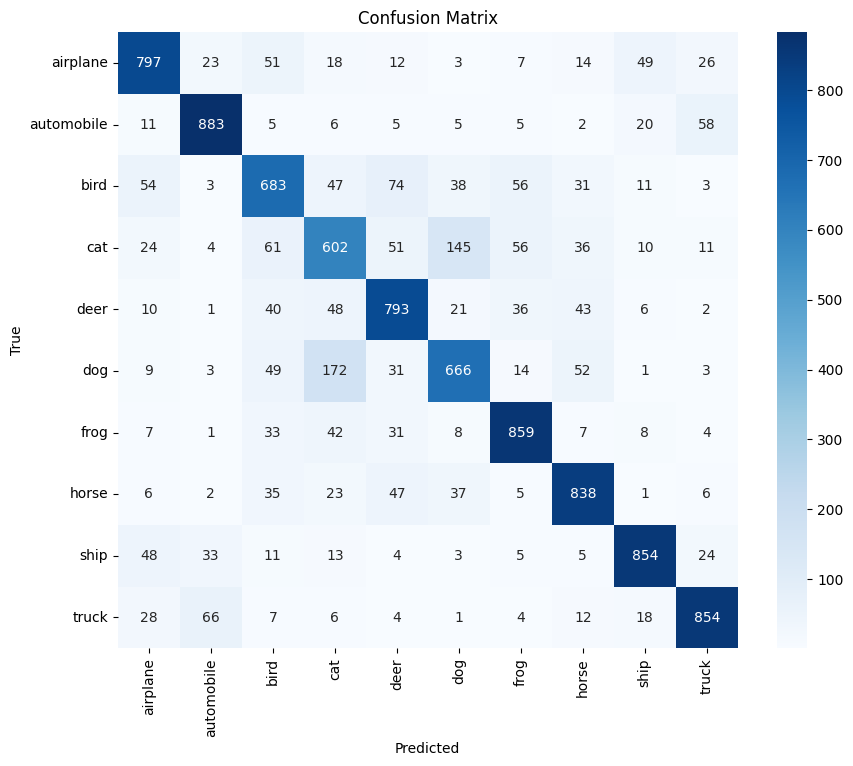

# Optimizasyon Karşılaştırma (CIFAR-10)
---
Bu projede, CIFAR-10 veri seti üzerinde derin öğrenme tabanlı bir görüntü sınıflandırma modeli eğitilmiş ve farklı optimizasyon algoritmalarının (Adam, RMSprop, SGD) performansları karşılaştırılmıştır. Eğitim süreci, model mimarisi, sonuçlar ve analizler detaylı olarak bu repoda sunulmaktadır.

## Proje Yapısı

```
Optimizer_Compare/
├── README.md                # Proje dokümantasyonu (bu dosya)
├── notebook/
│   └── optimizer_compare.ipynb  # Tüm kodun bulunduğu Jupyter defteri
├── assests/
│   ├── confusion_matrix.png     # Karışıklık matrisi görseli
│   ├── train_acc.png           # Eğitim doğruluk grafiği
│   ├── val_loss.png            # Doğrulama kaybı grafiği
│   ├── val_acc.png             # Doğrulama doğruluk grafiği
│   └── compare_all.png         # Tüm optimizasyonların karşılaştırmalı grafiği
├── models/
│   ├── best_modelAdam.keras    # Adam ile eğitilmiş en iyi model
│   ├── best_modelRMSprop.keras # RMSprop ile eğitilmiş en iyi model
│   └── best_modelSGD.keras     # SGD ile eğitilmiş en iyi model
└── ... (diğer yardımcı dosyalar)
```

## Projenin Amacı

Farklı optimizasyon algoritmalarının (Adam, RMSprop, SGD) aynı model ve veri seti üzerinde nasıl performans gösterdiğini karşılaştırmak. Amaç, eğitim ve doğrulama süreçlerinde hangi optimizasyon algoritmasının daha hızlı ve daha iyi genelleme yaptığına dair içgörü elde etmektir.

## Kullanılan Veri Seti

- **CIFAR-10**: 10 farklı sınıfa ait 60.000 renkli (32x32) görüntüden oluşan, makine öğrenmesi ve derin öğrenme alanında yaygın olarak kullanılan bir veri setidir.
- Veri seti otomatik olarak `keras.datasets` üzerinden indirilir.
- Eğitim/Doğrulama/Test ayrımı: %85 eğitim, %15 doğrulama, 10.000 test örneği.

## Model Mimarisi

- 2 bloklu Convolutional Neural Network (CNN):
  - Her blokta 2 adet Conv2D + BatchNorm + ReLU + MaxPooling
  - Flatten katmanı
  - 2 adet Dense katmanı (256 ve 128 nöron, BatchNorm, ReLU, Dropout)
  - Çıkış: 10 sınıf için softmax
- Toplam parametre: ~511.000
- L2 regularizasyon ve Dropout ile aşırı öğrenme önlenmiştir.

## Optimizasyon Algoritmaları

Aşağıdaki optimizasyon algoritmaları karşılaştırılmıştır:
- **Adam**
- **RMSprop**
- **SGD**

Her biri için aynı model sıfırdan eğitilmiş, en iyi ağırlıklar ayrı ayrı kaydedilmiştir.

## Eğitim Süreci

- Kayıp fonksiyonu: Categorical Crossentropy
- Başarı metriği: Accuracy
- Erken durdurma (EarlyStopping), ModelCheckpoint ve ReduceLROnPlateau callback'leri kullanıldı.
- Maksimum epoch: 50
- Batch size: 32
- (İsteğe bağlı olarak veri artırma - data augmentation kodu mevcut, ancak kapalı)

--- 
## Sonuçlar ve Analizler

Aşağıda, farklı optimizasyon algoritmalarının eğitim ve doğrulama süreçlerindeki performanslarını gösteren grafikler ve analizler yer almaktadır. Tüm görseller `assests/` klasöründe bulunur.

### 1. Tüm Optimizasyonların Karşılaştırması



Yukarıdaki grafikte, Adam, RMSprop ve SGD optimizasyon algoritmalarının doğruluk (accuracy) ve kayıp (loss) değerlerinin epoch bazında değişimi karşılaştırılmıştır. Adam ve RMSprop algoritmalarının daha hızlı yakınsadığı ve daha yüksek doğruluk elde ettiği görülmektedir. SGD ise daha yavaş öğrenmekte ve doğruluk seviyesi daha düşük kalmaktadır.

### 2. Train Accuracy Grafiği



Bu grafik, eğitim sürecinde modelin doğruluk değerinin epoch bazında nasıl değiştiğini göstermektedir. Adam ve RMSprop optimizasyonları, eğitim doğruluğunda daha hızlı artış göstermektedir.

### 3. Validation Accuracy Grafiği



Doğrulama doğruluğu, modelin eğitim sırasında aşırı öğrenme (overfitting) yapıp yapmadığını ve genelleme başarısını gösterir. Adam ve RMSprop, doğrulama setinde de SGD'ye göre daha iyi performans göstermektedir.

### 4. Validation Loss Grafiği



Doğrulama kaybı, modelin doğrulama verisindeki hata oranını gösterir. Adam ve RMSprop algoritmalarında doğrulama kaybı daha hızlı düşmekte ve daha düşük seviyelerde kalmaktadır.

### 5. Confusion Matrix



Karışıklık matrisi, en iyi modelin (genellikle Adam ile eğitilen) test verisindeki sınıflandırma başarısını detaylı olarak gösterir. Hangi sınıfların daha çok karıştırıldığı ve modelin hangi sınıflarda daha başarılı olduğu bu matris üzerinden analiz edilebilir.

#### Genel Değerlendirme
- **Adam** optimizasyonu, hem eğitim hem de doğrulama setinde en yüksek doğruluğu ve en düşük kaybı sağlamıştır.
- **RMSprop** da Adam'a yakın performans göstermiştir.
- **SGD** ise daha yavaş öğrenmiş ve doğruluk seviyesi düşük kalmıştır.
- Görseller, modelin eğitim ve doğrulama süreçlerinde nasıl davrandığını ve hangi optimizasyonun daha iyi genelleme yaptığını açıkça göstermektedir.
